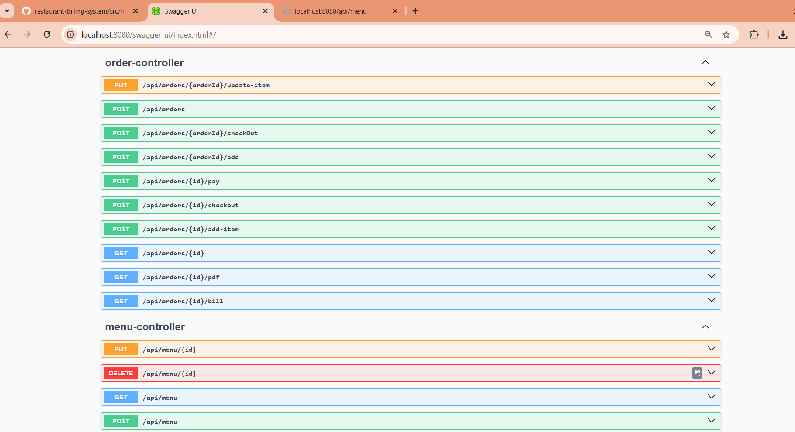
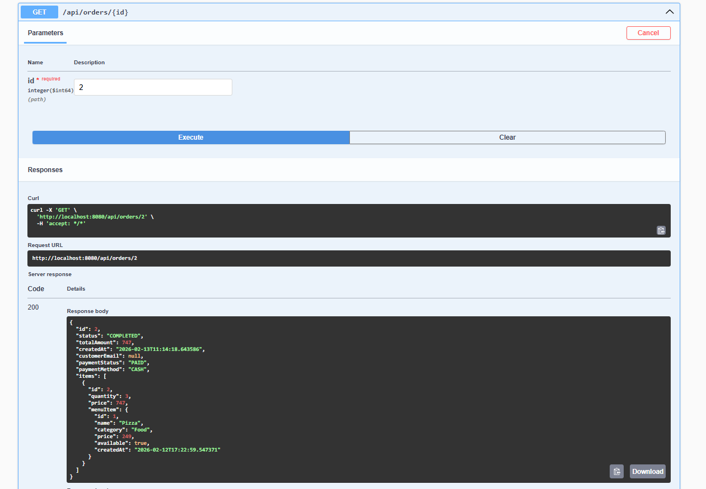
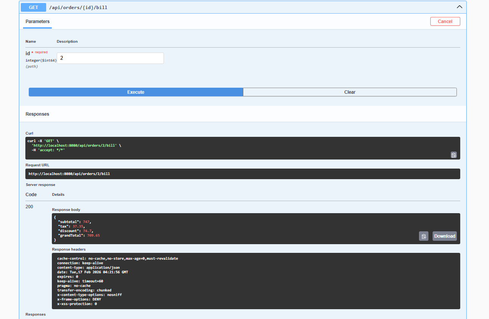
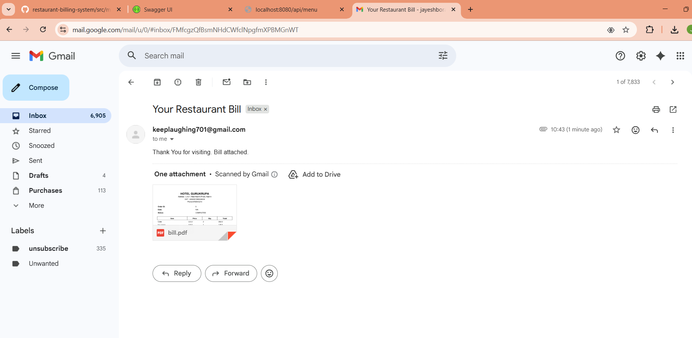

# 🍽️ Restaurant Billing System

A **full-stack backend restaurant billing application** built using **Spring Boot + PostgreSQL** that manages orders, generates bills, exports PDF invoices, and sends real-time email receipts to customers.

---

## 🚀 Features

### 🧾 Order Management

* Create new orders
* Add/remove items
* Update quantities
* Order status tracking

### 📋 Menu Management

* Add menu items
* Update price & availability
* Category support

### 💰 Billing Engine

* Automatic total calculation
* Item-wise pricing
* Real-time bill preview

### 📄 Invoice System

* Generate PDF invoice
* Download bill API
* Professional formatted invoice

### 📧 Real-Time Email

* Sends bill PDF automatically after checkout
* Uses SMTP mail service

### 🔒 Robust Backend

* Layered architecture (Controller → Service → Repository)
* DTO validation
* Exception handling
* RESTful APIs
* Swagger API testing

---

## 🛠️ Tech Stack

| Layer      | Technology            |
| ---------- | --------------------- |
| Backend    | Spring Boot           |
| Database   | PostgreSQL            |
| ORM        | Hibernate / JPA       |
| Docs       | Swagger OpenAPI       |
| PDF        | iText / PDF Generator |
| Mail       | Spring Mail           |
| Build Tool | Maven                 |

---

## 📂 Project Structure

```
src/main/java/com/restaurant/billing
│
├── controller
├── service
├── repository
├── entity
├── dto
├── util
└── config
```

---

## ⚙️ Setup Instructions

### 1️⃣ Clone Repo

```
git clone https://github.com/yourusername/restaurant-billing-system.git
```

### 2️⃣ Configure Database

Edit:

```
application.properties
```

```
spring.datasource.url=jdbc:postgresql://localhost:5432/billingdb
spring.datasource.username=postgres
spring.datasource.password=yourpassword
```

---

### 3️⃣ Configure Email

```
spring.mail.username=yourgmail@gmail.com
spring.mail.password=app_password
```

---

### 4️⃣ Run Project

```
mvn spring-boot:run
```

---

## 📡 API Endpoints

### Orders

```
POST   /api/orders
GET    /api/orders/{id}
POST   /api/orders/{id}/add-item
POST   /api/orders/{id}/checkout
GET    /api/orders/{id}/bill
GET    /api/orders/{id}/pdf
PUT    /api/orders/{orderId}/update-item
```

---

### Menu

```
POST   /api/menu
GET    /api/menu
PUT    /api/menu/{id}
DELETE /api/menu/{id}
```

---

## 🧪 Testing APIs

Open Swagger UI:

```
http://localhost:8080/swagger-ui/index.html
```

---

## 🖼 Screenshots






---

## 🧠 Architecture Flow

```
Client → Controller → Service → Repository → Database
                           ↓
                        PDF Generator
                           ↓
                        Email Sender
```

---

## 🎯 Future Enhancements

* JWT Authentication
* Admin Dashboard
* Payment Gateway Integration
* Analytics Reports
* Docker Deployment

---

## 👨‍💻 Author

**Jayesh Borase**
**+91 7798319136**
**jayeshborase701@gmail.com**

---

## ⭐ If you like this project

Give it a ⭐ on GitHub and share feedback!
